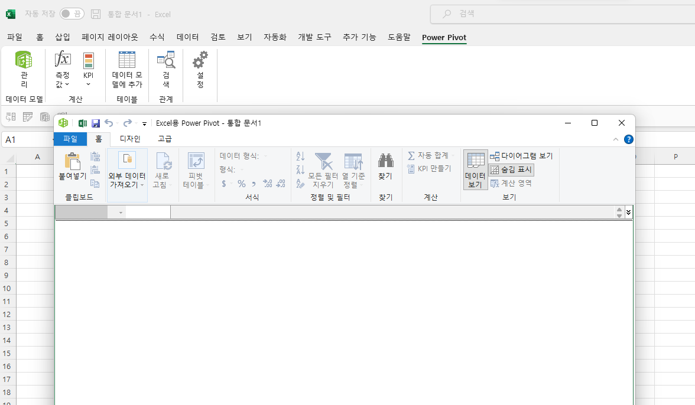

# DAX  Studio 기초

### DAX

DAX(Data Analysis Expressions)는 여러 함수와 연산자로 구성된 라이브러리로서, 이러한 구성 요소를 결합하여 Power BI, Analysis Services 및 Excel 데이터 모델의 파워 피벗에서 수식과 식을 작성할 수 있습니다.

참고

엑셀은 Power Pivot 설치 후, 피봇테이블 생성 시 ‘데이터 모델에 추가’를 하거나 테이블 선택 후 아래 화면과 같이 Power Pivot 탭 ‘데이터 모델에 추가’를 하면 dax 함수 사용 가능



### DAX Studio

dax query 를 작성하여, 측정값을 테이블 형태로 미리 작성할 수 있고, 쿼리문 정리,

대시보드 성능 파악

복잡한 측정값(가상테이블 포함)의 결과값이 잘못 나온 이유의 확인이 어려움
> 쿼리문으로 가상 테이블 등의 중간 과정 결과를 확인할 수 있다.

[다운](https://daxstudio.org/downloads/)

설치 후 Power BI  외부 도구에서 실행 가능


**화면 구성**


상단: 메뉴

왼쪽: 데이터 셋과 테이블

오른쪽: 쿼리문 입력 부분

하단: 로그, 히스토리

**작성기본 테이블식**

```jsx
DEFINE
var A = {table or value}

EVALUATE
calculatetable(A,필터) or
calculatetable(table,필터=A)
```

**dax 쿼리에 selectedvalue()나 min(), max() 등 함수는 정상 작동 안됨,**
필터로 적용된 값이 아닌 전체값을 기준으로 계산됨

쿼리문에 포함되어 있는 경우 실제 값으로 변경

예)      min(min('DT_E_BASEDATE_KEYWORD'[date]) >>>>>  date(2022,01,01)

**예시 - 계산그룹식**

1페이지 차트3 ‘2억미만’ 값

```jsx
var order_value_table = 
addcolumns(addcolumns(addcolumns(summarize(
    'FT_E_PRODUCT_PURCHASE', 
    'FT_E_PRODUCT_PURCHASE'[mallid],
    "min_date",calculate(min('FT_E_PRODUCT_PURCHASE'[delivered_final]),
    'FT_E_PRODUCT_PURCHASE'[delivered_final]>=min('DT_E_BASEDATE_REVIEWS'[date])),
    "max_date",calculate(max('FT_E_PRODUCT_PURCHASE'[delivered_final]),
    'FT_E_PRODUCT_PURCHASE'[delivered_final]<=max('DT_E_BASEDATE_REVIEWS'[date]))),
    "timediff", int([max_date] - [min_date])),
    "order_value",
    divide(calculate(
    sumx('FT_E_PRODUCT_PURCHASE',
    'FT_E_PRODUCT_PURCHASE'[sub_orders_count]*
    related('DT_E_PRODUCT_INFO'[org_price_cents])),
    'FT_E_PRODUCT_PURCHASE'[delivered_final]>=
    min('DT_E_BASEDATE_REVIEWS'[date]) && 
    'FT_E_PRODUCT_PURCHASE'[delivered_final]<=
    max('DT_E_BASEDATE_REVIEWS'[date])),[timediff])*30),
    "criteria",
    switch(true(), 
    [order_value]<200000000,"2억 미만",
    [order_value]>=200000000 && [order_value]<400000000,"2-4억 사이",
    [order_value]>=400000000 && [order_value]<700000000,"4-7억 사이",
    [order_value]>=700000000 && [order_value]<1000000000,"7-10억 사이",
    [order_value]>=1000000000,"10억 이상"))

var sales_table = summarize(
    filter(
    order_value_table,
    [criteria]="2억 미만"),
    [mallid])

var scope_1 = distinct('DT_E_CATEGORY_CATEGORY'[mallid])
var scope_2 = distinct('DT_E_CATEGORY_GENDER'[mallid])
var scope_3 = distinct('DT_E_CATEGORY_AGE'[mallid])
var scope_4 = distinct('DT_E_CATEGORY_STYLE'[mallid])    
    
var result_opt1 = intersect(
intersect(intersect(intersect(scope_1, scope_2),scope_3),scope_4),
sales_table) 

return

CALCULATE ( SELECTEDMEASURE (), 
KEEPFILTERS('FT_E_PRODUCT_KEYWORD'[mallid] in sales_table && 'FT_E_PRODUCT_KEYWORD'[mallid] <> selectedvalue('DT_E_MALLID'[mallid])),
REMOVEFILTERS ( 'DT_E_MALLID'[mallid] ) )
```

order_value_table 결과


result_opt1 결과


예시 - 측정값

1페이지 차트1 ‘가방’ 매출

db 카테고리가 ‘가방’인 전체 고객사들의 매출을 구하기 위해 작성

몰필터에서 카테고리 외 다른 필터는 삭제

```jsx
define

var scope_1 = 
summarize(
calculatetable(DT_E_CATEGORY_CATEGORY,
keepfilters('DT_E_CATEGORY_CATEGORY'[category]="가방"),
removefilters('DT_E_CATEGORY_CATEGORY_FILTER'[카테고리])
),[mallid])

evaluate

filter(
addcolumns(
	summarize(CALCULATETABLE('FT_E_PRODUCT_PURCHASE', 'FT_E_PRODUCT_PURCHASE'[mallid] in scope_1
	),
	'FT_E_PRODUCT_PURCHASE'[mallid]),
	"order_value",
	    calculate(
	    sumx('FT_E_PRODUCT_PURCHASE','FT_E_PRODUCT_PURCHASE'[sub_orders_count]*related('DT_E_PRODUCT_INFO'[org_price_cents])),
	    'FT_E_PRODUCT_PURCHASE'[delivered_final]>=min(DT_E_BASEDATE_REVIEWS[date]) && 'FT_E_PRODUCT_PURCHASE'[delivered_final]<= max(DT_E_BASEDATE_REVIEWS[date]))
),[order_value]>0)
```

결과


측정값 사용은 테이블에서 sumx 나 countx, averagex로 최종값 추가